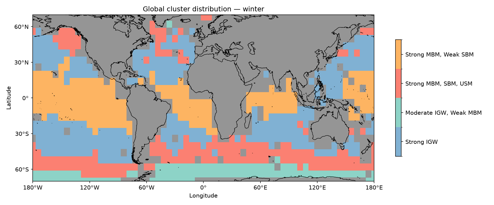
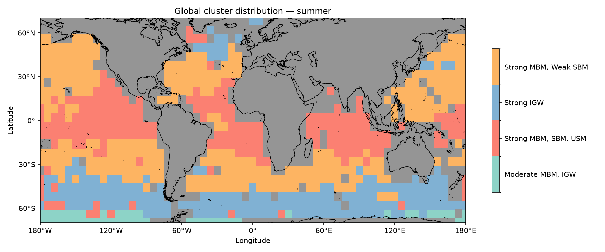

# SSH Spectral Clustering

Classification of global ocean sea surface height (SSH) wavenumber-frequency
spectra into distinct dynamical regimes (e.g. internal gravity wave / IGW
dominant, mesoscale balanced motion / MBM dominant, mixed regimes) via PCA +
Gaussian Mixture Model (GMM) clustering, run separately for summer and
winter.

This code accompanies the clustering stage of:

> Anshul Agarwal, *When and Where Does Generative AI Imputation Work? Filling
> Temporal Gaps with Implications for SWOT Satellite Altimetry*, S.M. thesis,
> Massachusetts Institute of Technology, 2027.

SSH is taken from the MITgcm-LLC4320 global high-resolution ocean simulation
(used as a ground-truth proxy). Wavenumber-frequency spectra at each grid
location are clustered to identify dynamical regimes and characterize how
they vary seasonally and geographically — motivating where and when temporal
gap-filling (the thesis's main contribution) is easier or harder.

## Pipeline

For each season (`summer`, `winter`):

1. **Load spectra** — read the per-location wavenumber-frequency `Spectrum`
   from each netCDF file, scale by wavenumber x frequency, take the log, and
   L2-normalize.
2. **Reduce dimensions** — PCA retaining 95% of variance.
3. **Select cluster count** — fit GMMs over a range of component counts and
   score them by BIC, AIC, and silhouette score.
4. **Fit final GMM** — cluster into `FINAL_N_CLUSTERS` regimes (default: 4,
   the number used in the thesis) with a fixed random seed for
   reproducibility.
5. **Diagnostics** — per-cluster mean spectrum and RMS deviation of each
   member spectrum from that mean, as a cohesion check.
6. **Map plots** — interpolate per-location cluster assignments onto a
   regular lat/lon grid and plot the global distribution of regimes, with
   land masked out.

All of this logic lives in [`src/ssh_clustering/`](src/ssh_clustering/); the
two original analysis notebooks are now thin drivers in
[`notebooks/`](notebooks/) that call into this package and reproduce the
season-specific paper figures.

## Example output

[`figures/summer/`](figures/summer/) and [`figures/winter/`](figures/winter/)
contain example output generated by running this code end-to-end against
the real LLC4320 SSH spectra (`ssh-clustering --season <season> ...`):
model-selection curves, the PCA scatter, each cluster's mean spectrum, and
the global cluster-distribution map — the same figures reproduced in the
thesis (BIC/AIC/silhouette selection, and the winter/summer regime maps).

| | |
|---|---|
|  |  |

## Changing the number of clusters

`FINAL_N_CLUSTERS = 4` in
[`src/ssh_clustering/config.py`](src/ssh_clustering/config.py) is the
published choice for both seasons, selected by inspecting BIC/AIC/silhouette
scores together with the physical interpretability of the resulting regimes.
It is **not hardcoded elsewhere** — to try a different number of clusters:

1. Change `FINAL_N_CLUSTERS` in `config.py` (or pass `--n-clusters` to the
   CLI / `n_components=` to `run_season_pipeline`).
2. Update the matching list in `SEASON_CLUSTER_NAMES` in the same file to
   have exactly that many descriptive labels, in cluster-index order — these
   names only exist for annotating the final map plot and are otherwise
   unused by the clustering itself.

## Installation

```bash
python -m venv .venv
source .venv/bin/activate
pip install -e ".[dev,notebooks]"
```

## Usage

### Command line

```bash
ssh-clustering --season winter \
  --data-root data/Global \
  --mask data/mask_to_plot_ratio.npz \
  --out-dir figures/winter
```

See [`data/README.md`](data/README.md) for the expected input data layout —
raw SSH spectra are not included in this repository.

### Notebooks

`notebooks/summer_analysis.ipynb` and `notebooks/winter_analysis.ipynb` walk
through the pipeline interactively and reproduce the thesis figures for each
season.

### Tests

```bash
pytest
```

Tests cover the pure numerical/plotting logic (RMS diagnostic, grid
interpolation, configuration) that doesn't require the raw netCDF data.

## Repository layout

```
src/ssh_clustering/   Package: data loading, PCA/GMM, diagnostics, plotting, CLI
notebooks/            Thin per-season driver notebooks (paper figures)
data/                 Land mask asset + instructions for obtaining raw SSH data
tests/                Unit tests for the pure-logic parts of the pipeline
figures/              figures/summer/ and figures/winter/ hold committed example
                      output (see above); any other output here is gitignored
```

## Citation

If you use this code, please cite:

```bibtex
@mastersthesis{agarwal2027generative,
  author = {Agarwal, Anshul},
  title  = {When and Where Does Generative AI Imputation Work? Filling Temporal
            Gaps with Implications for SWOT Satellite Altimetry},
  school = {Massachusetts Institute of Technology},
  year   = {2027},
  type   = {{S.M.} thesis}
}
```

## License

MIT — see [LICENSE](LICENSE).
